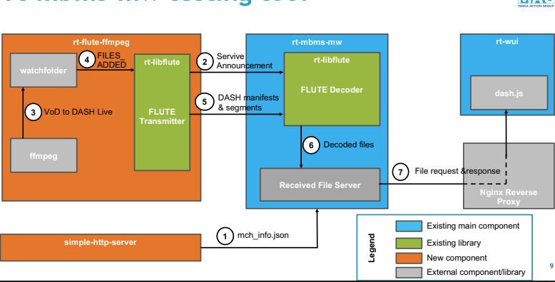

<h1 align="center">FLUTE ffmpeg</h1>

## Introduction

The goal of this example project is to provide a tool that enables rt-mbms-client development without the need for the
rt-mbms-modem. The basic idea is depicted in the illustration below:



We use ffmpeg to create a DASH or HLS live stream from a VoD file. The resulting manifest files and segments are written to a
watchfolder and send via rt-libflute as a multicast to the rt-mbms-client for further processing. rt-mbms-application or a plain dash.js/hls.js
can be used for playback.

## Installation

### Install dependencies
To use this project several dependencies need to be installed. First install the common dependencies:

#### Install common dependencies

```` 
sudo apt update
sudo apt install ninja-build libspdlog-dev libboost-all-dev libconfig++-dev
sudo snap install cmake --classic
````

#### Install Poco

We use the Poco directory watcher to implement the watchfolder behavior. In order to install Poco follow the
instructions [here](https://pocoproject.org/download.html).

In order to build from source:

````
git clone -b main https://github.com/pocoproject/poco.git
cd poco
mkdir cmake-build
cd cmake-build
cmake ..
cmake --build . --config Release
sudo cmake --build . --target install
````

#### Install libpistache

We use pistache as a REST framework to initialize the rt-mbms-client. We expose only one route that returns the multicast
channel information.

````
sudo add-apt-repository ppa:pistache+team/unstable
sudo apt update
sudo apt install libpistache-dev
````

## Build

### Clone the repository

````
git clone --recurse-submodules https://github.com/5G-MAG/rt-mbms-examples
```` 

> **Known issue on current toolchains:** the `flute-ffmpeg/lib/rt-libflute` submodule points at
> 5G-MAG's `rt-libflute` `development` branch, which still uses `boost::asio::io_service` /
> `deadline_timer` -- APIs Boost 1.90 removed. On a system whose only Boost is 1.90+ (any current
> Ubuntu), this build fails with `'io_service' has not been declared` and similar errors. A fix
> exists (port to `io_context`/`steady_timer`, plus one line in this project's own
> `src/FluteFfmpeg.h`) but as of this writing lives only on a personal fork, not yet upstreamed to
> 5G-MAG. Until it lands, either apply that port to the submodule yourself, or build against an
> older Boost (see the lab-wide tutorial's `-DBOOST_ROOT=/opt/boost-legacy` approach for how to set
> one up alongside your system Boost).

### Build setup

````
cd rt-mbms-examples/flute-ffmpeg
mkdir build && cd build
cmake -GNinja ..
````

### Building

````
ninja
````

This will output two files:  
* The watchfolder and FLUTE logic (`flute-ffmpeg`) 
* The simple webserver that provides the mulicast channel information to the middleware (`httpserver`).

## Configuration

Most of the parameters can directly be changed in the configuration file located at `config/config.cfg`. An example
configuration looks the following

````
general : {
          multicast_ip = "238.1.1.111";
          multicast_port = 40101;
          mtu = 1500;
          rate_limit = 1200000;
          watchfolder_path = "/home/<you>/rt-mbms-examples/flute-ffmpeg/watchfolder/hls";
          path_to_transmit = ""
          stream_type = "hls";
          transmit_service_announcement = false;
          dash: {
              number_of_init_segments = 3;
              resend_init_in_sec = 30;
              service_announcement = "../files/bootstrap.multipart.dash";
          };
          hls: {
              service_announcement = "../files/bootstrap.multipart.hls";
              media_playlists_to_ignore_in_multicast = []
          }
          webserver_port: 3010;
}
````

### Configure the stream format

We support both DASH and HLS with this sample implementation. Depending on the streaming format that you choose
the `stream_type` setting in the configuration needs to be adjusted accordingly.

### Configure watchfolder output path

We assume that the nginx proxy for rt-mbms-modem and rt-mbms-client has been installed and is running. We reuse the nginx
as a watchfolder. Any other path can be used as well. Using the nginx as a watchfolder enables us to play the generated
DASH and HLS manifests and segments before FLUTE encoding them and multicasting to the rt-mbms-client.

````
sudo mkdir /var/www/watchfolder_out
sudo chmod -R 777 /var/www/watchfolder_out
````

In case you are not using the default path the configuration file needs to be adjusted accordingly:

````
watchfolder_path = "path/to/folder";
````

### Configure the ffmpeg command

In order to generate a DASH or HLS stream we provide pre-configured ffmpeg scripts `files/ffmpeg-dash.sh`
and `files/ffmpeg-hls.sh` . In case the watchfolder was changed or a different input file should be used the script
needs to be adjusted accordingly.

### Configure the RESTful API

rt-mbms-client requires a multicast channel information file that is usually queried from the REST API of the modem. As part
of this example project we use a separate webserver that provides the file. By default this server starts with the
default settings that are also used for the rt-mbms-modem.

Configuration changes can be made in `src/HttpHandler.cpp` and `main_server.cpp`.

## Running

#### 1. Start rt-mbms-client

See the [documentation](https://github.com/5G-MAG/rt-mbms-client) for details. No special
`flute_ffmpeg`-style config key is needed on the client side -- there is no such key in the
current codebase (confirmed by grepping rt-mbms-client's source; an older revision of this
doc described one, but it never matched anything the client actually reads). The client
discovers this tool's FLUTE-delivered content automatically from the service announcement, the
same way it discovers any other MBMS service. If your cache's default `max_file_age` is too
short for your segment duration, raise it in `client.cache.max_file_age` (see rt-mbms-client's
README).

#### 2. Start the HTTP Server

````
cd build
./httpserver
````

#### 3. Start FLUTE ffmpeg

````
cd build
./flute-ffmpeg
````

#### 4. Start the DASH/HLS stream

````
cd files
sh ffmpeg-dash.sh
````

````
cd files
sh ffmpeg-hls.sh
````

#### 5. Start rt-mbms-application

See the [documentation](https://github.com/5G-MAG/rt-mbms-application) for details.

#### Other players

The streams can also be played outside of rt-mbms-application, for instance in a plain dash.js or hls.js.

#### An alternative: broadcast it for real, through the BM-SC

This standalone tool talks FLUTE directly to rt-mbms-client, bypassing the BM-SC and MBMS-GW
entirely -- good for client-side development without a modem. To actually put this same ffmpeg
output out over the air (BM-SC ingests it via xMB, FLUTE-encodes it, and it goes through the real
MBMS-GW/eNB/modem chain), see
`../scripts/tmux/mbms-broadcast-tutorial/` instead: serve `watchfolder/hls/` over plain HTTP and
point an xMB Application/Pull session's `applicationEntryPointURL` at it (its
`demo-content/README.md` and `ffmpeg-local.json` walk through exactly this).
